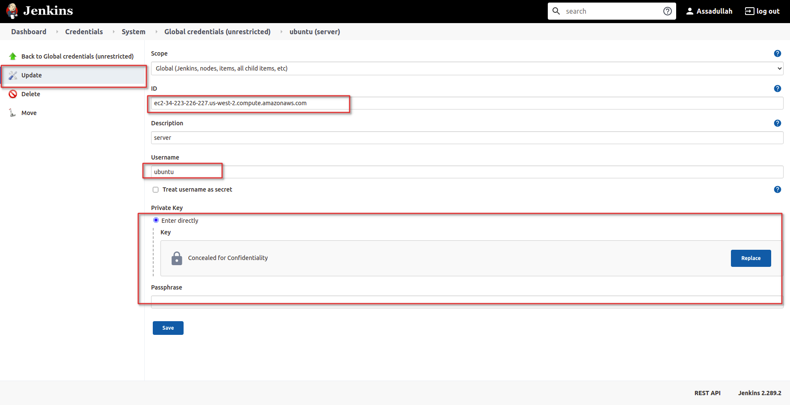
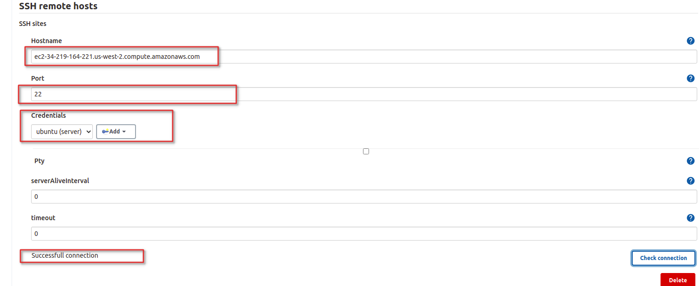

## Introduction:
In this project, i am going to provision one linux vm (ubuntu 14.04) using Terraform automation (IaC), code is added in terraform script to install docker and make it capable for running docker images, and open port 80 and 22 for ssh. Once the vm is provisioned, then next step is to create the docker file for nginx container, then final step is to build and deploy the dockerfile to the provisioned vm


## Terraform automation to provision the vm
#### Pre-requisite
1. Install Terraform for linux
2. Install aws CLI

Craete the file wit name main.tf and write terrfaorm code\
1. define variables for access, secret key and region
```
variable "access_key" {
	default = "<your_access_key>"
}
variable "secret_key" {
	default = "<your_private_key>"
}
variable "region" {
    default = "us-west-2"
}

```
**NOTE:** If you dont want to how your access_key, secret_key and region, then you can first export these values on your system, then once you deploy these reosurces, by default these will be deployed on that aws account.

2. Next step is to setup aws provider
```
/* Setup our aws provider */
provider "aws" {
  access_key  = "${var.access_key}"
  secret_key  = "${var.secret_key}"
  region      = "${var.region}"
}
```

3. Create security group for allowing ssh and http
```
resource "aws_security_group" "myInstance-ssh-http" {
        name = "ssh-http-security-group"
        description = "Allowing ssh and http traffic"


        ingress {
                from_port = 22
                to_port   = 22
                protocol  = "tcp"
                cidr_blocks = ["0.0.0.0/0"]
      }

        ingress {
                from_port = 80
                to_port   = 80
                protocol  = "tcp"
                cidr_blocks = ["0.0.0.0/0"]
      }

      egress {
                from_port   = "0"
                to_port     = "0"
                protocol    = "-1"
                cidr_blocks = ["0.0.0.0/0"]
                self        = true
    }
```
4. Before creating ec2 instance create primary key, 
Go to the Network and security and click on key pairs and click on create new key pair


The pem file private key will be downloaed, now go to the folder and give permissions of chmod 400 key_file


5. Create ec2 instance, attach security group and give key_name then write docker installation commands for ubuntu 14.04
```
/*Creating aws ec2 instance */
resource "aws_instance" "myInstance" {
  ami           = "ami-830c94e3"
  instance_type = "t2.micro"
  security_groups = ["${aws_security_group.myInstance-ssh-http.name}"]
  key_name = "demo-key-terraform-us-east-2"
  user_data     = <<-EOF
                  #!/bin/bash
                  sudo apt-get update
                  sudo apt-get -y install docker.io
                  sudo ln -sf /usr/bin/docker.io /usr/local/bin/docker
                  sudo sed -i '$acomplete -F _docker docker' /etc/bash_completion.d/docker.io                   
                  EOF
    

  tags = {
    Name = "dockervm"
  }
}
```
The above commands in user data will be execueted once the vm is deployed successfully.

6. Output the public_dns which will be used for connecting the instance
```
output "DNS" {
  value = aws_instance.myInstance.public_dns
}
```

7. Go to the folder containing the terraform script then run the command **terraform init**. This will initialize the terraform


8. Run the command **terraform plan** to check the execution plan

9. Run the command **terraform apply** for provisioning ther resource 

10. Now go to the region of aws that you mentioned, you will see the vm would be provisioned


11. Connect the vm by running the command 
```
ssh -i "demo-key-terraform-us-east-2.pem" ubuntu@ec2-34-219-164-221.us-west-2.compute.amazonaws.com
```


12. You can check docker installation by running command **docker --version**


13. Go to the security group and verify that port 22 and 80 are open


## Dockerfile to Create the nginx Image
```
FROM ubuntu
RUN sudo apt-get update
RUN sudo apt-get install -y nginx
```

## Create the Jenkins CICD pipeline to deploy and build the dockerfile
1. First go to the jenkins and create freestype project with name DeployNginxToAWSVM


2. Go to the plugin and install ssh plugin


3. Next step is to save credential for ec2 resource storing pem file key. Go to the manageJenkins then click manage credentials


4. Click on add credentials and select global from drop down, give value of public_dns in ID and give username value and finally paste your private key pem file



5. You can verify the connection by going to manage jenkins and configuration system

**Note:** In this way secure connection is possible without exposing the password or private key

6. Now go to the project that you created earlier and then click on the configuration section, scroll down and select **execute shell script on remote host** then inside shell script write the script for creating the dockerfile for nginx
```
touch Dockerfile
echo -e "FROM ubuntu \nRUN apt-get update \nRUN apt-get install -y nginx \nCMD [\"echo\", \"Image created\"]" > Dockerfile
sudo docker build .
```


**Note:** Dockerfile can also be deployed from github to vm using jenkins

7. Now build the pipeline 


7. The dockerfile is deployed to vm and build successfully


8. Now you can run the nginx container on the  ec2 instance


